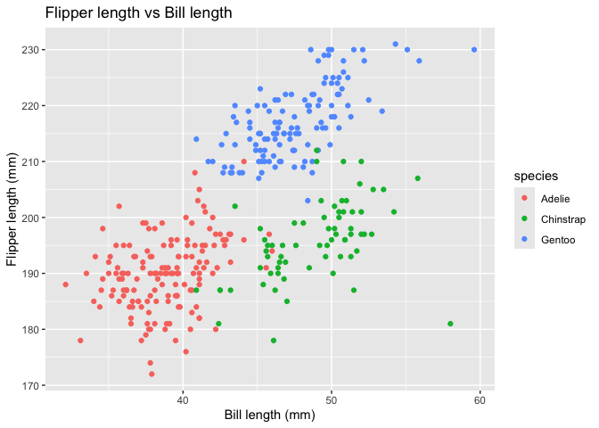

p8105_hw1_yw4854
================
Yuxuan Wang
2026-09-26

``` r
library(tidyverse)
data("penguins", package = "palmerpenguins")
```

# Problem 1

The dataset contains data on adult penguins across 3 species in the
Palmer Archipelago, Antarctica. The dataset has 344 rows and 8 columns.

Important variables：

- `Species`: Penguin species (Adelie, Chinstrap, Gentoo)

- `Island`: Penguin Habitat (Biscoe, Dream, Torgersen)

- `bill_length_mm`: bill length (millimeters)

- `bill_depth_mm`: bill depth (millimeters)

- `flipper_length_mm`: flipper length (millimeters)

- `body_mass_g`: body mass (grams)

- `sex`: penguin sex (female, male)

- `year`: study year

the mean flipper length: 200.9152047

### scatterplot:

``` r
penguin_plot <- ggplot(penguins, aes(x = bill_length_mm, y = flipper_length_mm, color = species)) +
  geom_point() +
  labs(
  title = "Flipper length vs Bill length",
  x = "Bill length (mm)",
  y = "Flipper length (mm)",
  color = "species"
)

penguin_plot
```

<!-- -->

``` r
ggsave("scatter_plot.png", penguin_plot)
```

    ## Saving 7 x 5 in image
